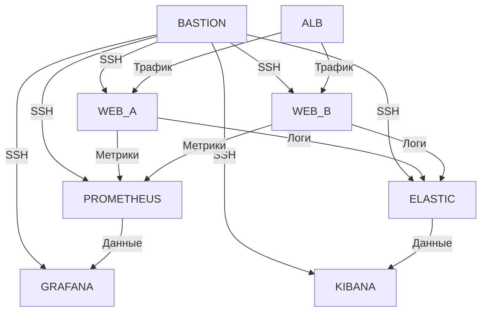

# Курсовая работа на профессии "DevOps-инженер с нуля - Барышков Михаил

## 1. Архитектура решения

### Схема инфраструктуры

## 2. Компоненты системы

### Terraform инфраструктура

Компонент |	Характеристики | 	Назначение | 
|---------|----------------|---------------|
Сеть | 	2 подсети | (10.0.1.0/24, 10.0.2.0/24) Разделение на зоны доступности |
|Bastion	| 2vCPU, 1GB RAM	|Единая точка входа|
Веб-серверы	| 2vCPU, 1GB RAM (x2) |	Nginx + экспортеры|
Prometheus |	2vCPU, 4GB RAM |	Сбор метрик
Grafana	| 2vCPU, 4GB RAM	| Визуализация данных

### Ansible конфигурация

Основные playbook'и:

- common_docker.yml - установка Docker
- nginx.yml - настройка Nginx
- prometheus.yml - развертывание Prometheus
- filebeat.yml - сбор логов
- elasticsearch.yml - настройка Elasticsearch

playbooks/
├── webservers.yml       # Основной playbook для веб-серверов (включает задачи nginx)
├── elasticsearch.yml
├── kibana.yml
├── prometheus.yml
├── grafana.yml
├── filebeat.yml
├── common_docker.yml    # Только задачи, не запускается напрямую

Запустите playbooks в правильном порядке:
bash

ansible-playbook -i ../hosts.ini playbooks/common_docker.yml
ansible-playbook -i ../hosts.ini playbooks/elasticsearch.yml
ansible-playbook -i ../hosts.ini playbooks/kibana.yml
ansible-playbook -i ../hosts.ini playbooks/prometheus.yml
ansible-playbook -i ../hosts.ini playbooks/grafana.yml
ansible-playbook -i ../hosts.ini playbooks/filebeat.yml
ansible-playbook -i ../hosts.ini playbooks/nginx.yml

Для проверки работы Docker после common_docker.yml можно выполнить:
bash

ansible all -i ../hosts.ini -m command -a "docker --version"